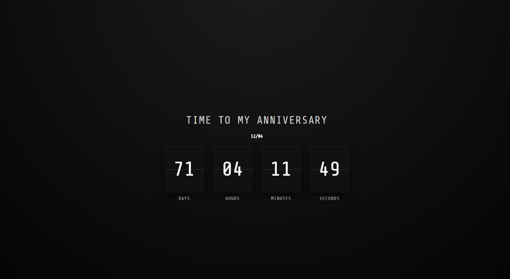

# Anniversary Countdown

A simple and elegant web application that displays a live countdown to an anniversary date. Built using Clean Architecture principles in JavaScript.



## Features

- **Live Countdown**: Real-time countdown showing days, hours, minutes, and seconds remaining until the anniversary.
- **Clean Architecture**: Organized into Domain, Application, and Infrastructure layers for maintainability and scalability.
- **Responsive Design**: Dark theme with flip-card style animations for a modern look.
- **Date Handling**: Utilizes Day.js library for accurate date calculations.

## Technologies Used

- **HTML5**: Structure of the web page.
- **CSS3**: Styling with a dark radial gradient background and flip-card animations.
- **JavaScript (ES6 Modules)**: Core logic implemented with Clean Architecture.
- **Day.js**: Lightweight date manipulation library.

## Project Structure

```
anniversaryCountdown/
├── index.html          # Main HTML file
├── main.js             # Entry point and application initialization
├── style.css           # Stylesheet for the countdown display
├── application/
│   └── CountdownUseCase.js  # Application logic for countdown
├── domain/
│   └── ValueObjects.js      # Domain entities (Anniversary)
└── infrastructure/
    ├── ConsolePresenter.js  # Console output presenter
    ├── ControlePresentear.js # (Additional presenter)
    ├── DayjsDateService.js   # Date service using Day.js
    └── htmlPresenter.js      # HTML DOM presenter
```

## How to Run

1. Clone or download the repository.
2. Open `index.html` in your preferred web browser.
3. The countdown will automatically start and update every second.

No server or build process is required; it's a static web page.

## Demo

The application displays a countdown timer with flip-card animations for each unit (days, hours, minutes, seconds). The anniversary date is set to December 4th.

## Author

Thiago - Portfolio Project

## License

This project is open source and available under the [MIT License](LICENSE).